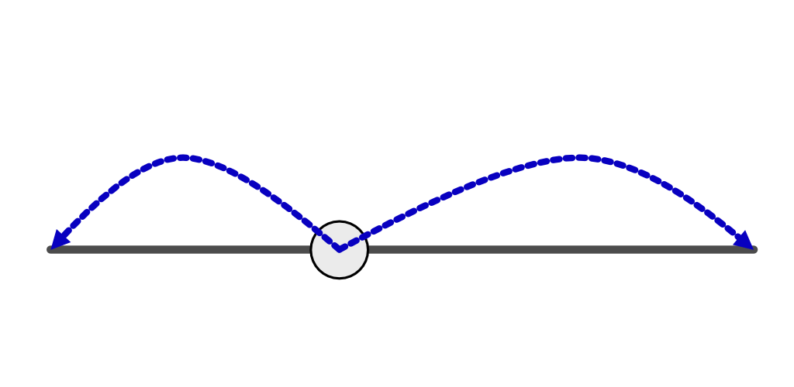

# PyWalk

A python module written in C++ to efficently simulate random walks



# Build
```bash
mkdir build && cd build
cmake ..
```

## Requirements
- Boost
- OpenMP
- Python

# Functions
```python
import pywalk
pywalk.step(1)

pywalk.run_walk()

pywalk.get_arrival_list()
```

# License
See [LICENSE](LICENSE)